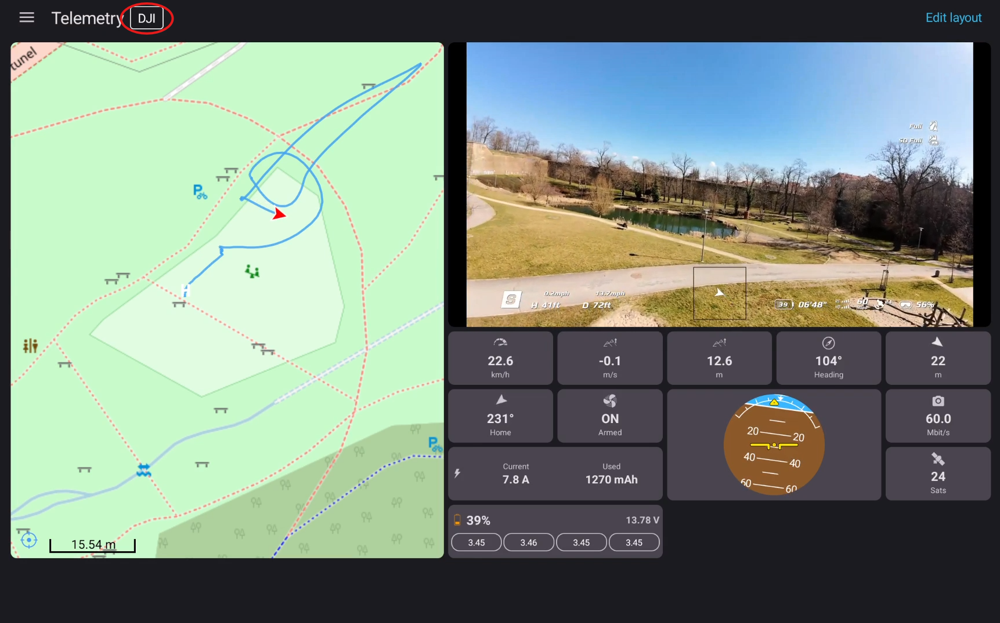

# Receiving Telemetry From DJI Drones

Getting telemetry from a DJI drone is straightforward. Connect the goggles to a compatible DJI drone, then open the **Telemetry** tab in SquirrelCast.

Supported DJI drones include:
- DJI Neo series
- DJI Avata series
- Compatible DJI Mini drones

If telemetry is being received, the **DJI telemetry** indicator at the top of the Telemetry tab will show that it is active.

If you are using a DJI air unit instead of a DJI drone, see [Receiving telemetry from the ELRS backpack over Wi-Fi](receiving-telemetry-from-elrs-backpack-over-wifi.md).
