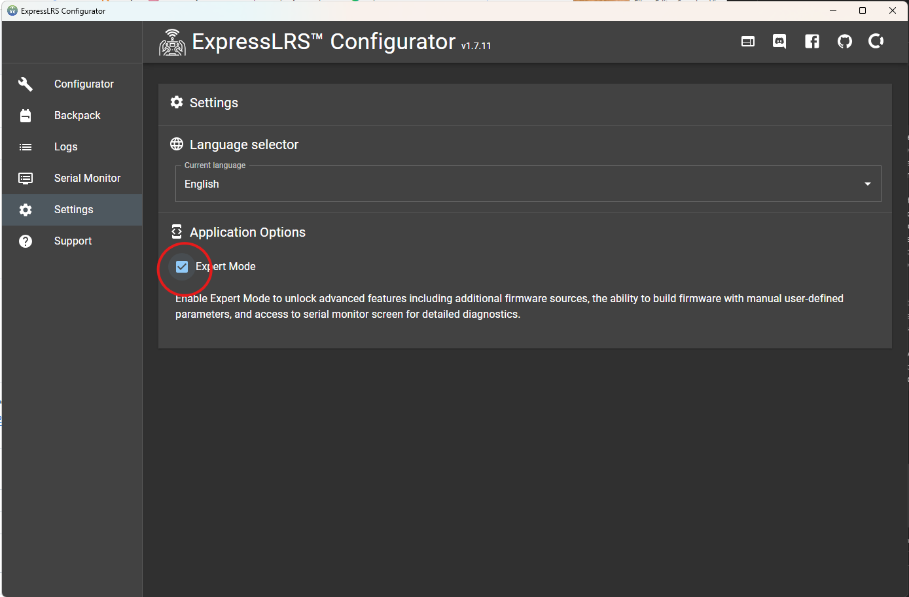
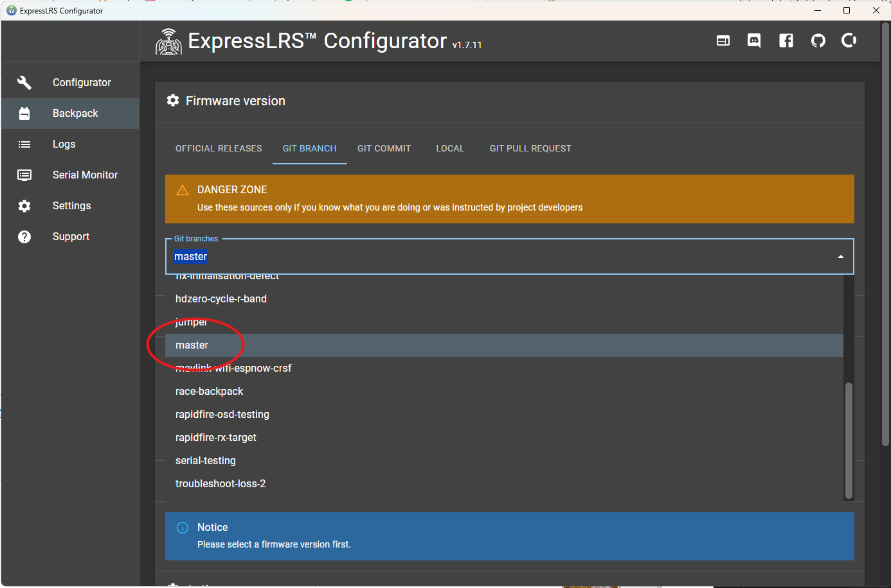
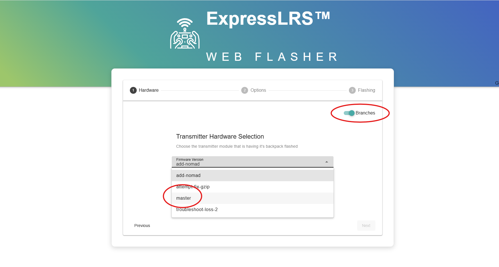
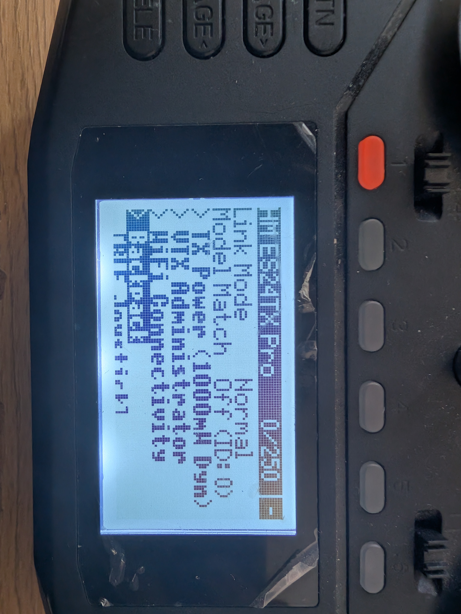
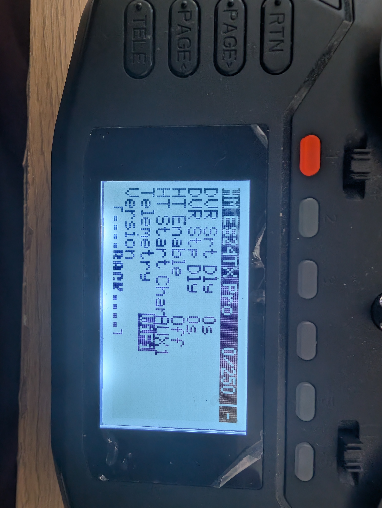
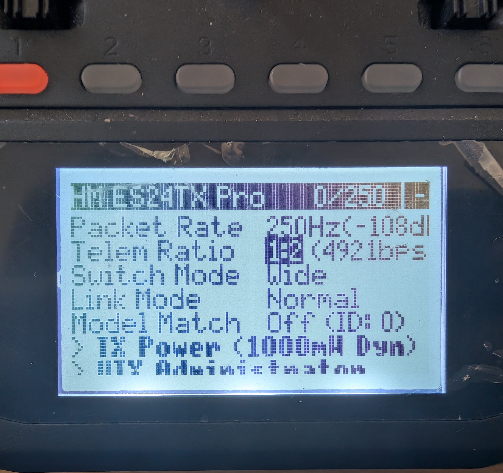
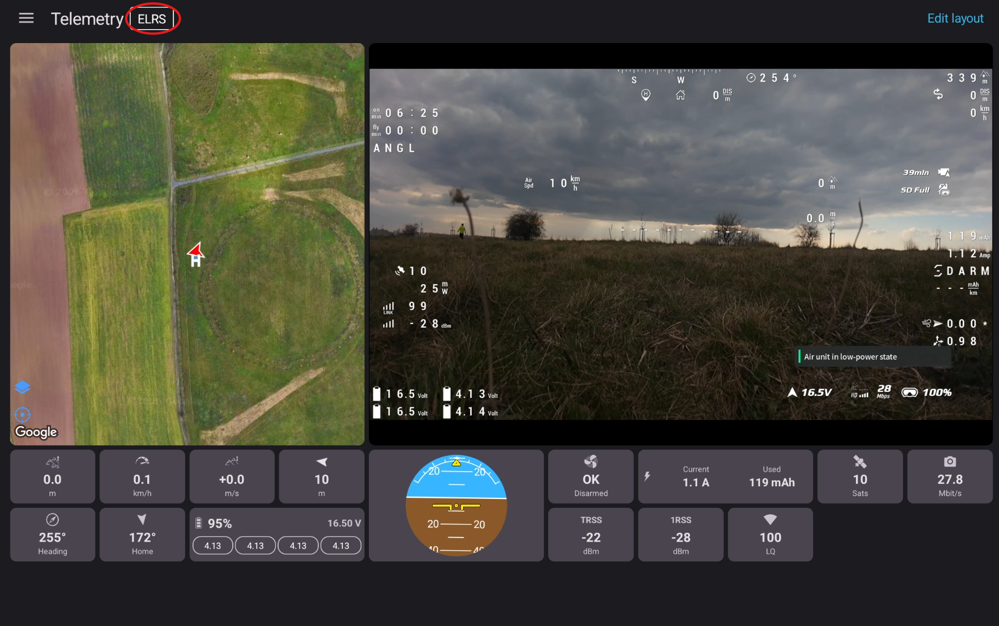
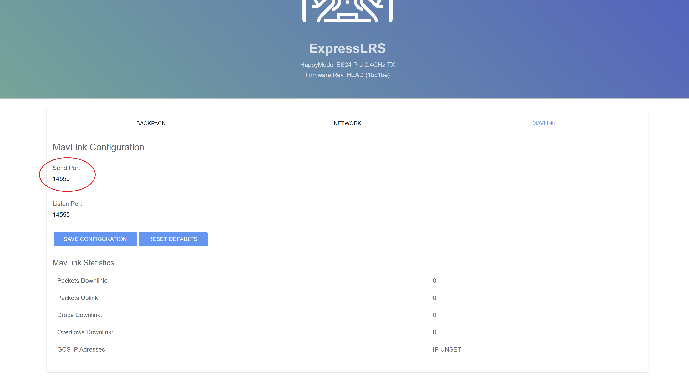
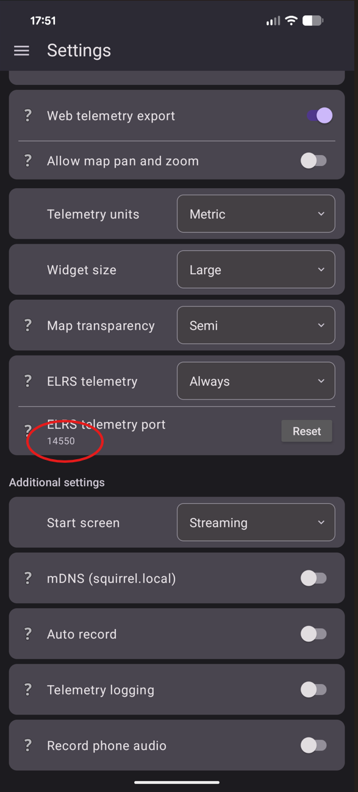

# Receiving Telemetry From the ELRS Backpack Over Wi-Fi

SquirrelCast currently receives **CRSF telemetry over Wi-Fi UDP broadcast** from the TX backpack. The phone or tablet and the backpack need to be on the same Wi-Fi network.

For the initial backpack setup, follow the official ExpressLRS guide:  
[Flashing via WiFi](https://www.expresslrs.org/hardware/backpack/backpack-tx-setup/#flashing-via-wifi)

It is recommended to set the Backpack Home Wi-Fi **SSID** and **password** to match your phone hotspot when flashing. That gives you both options later:
- automatic connection to your phone hotspot or home network
- direct connection to the backpack's own Wi-Fi access point

## Flash the master branch

At the time of writing, this feature is available on the `master` branch and is not yet part of the stable Backpack release used for this guide. To use it now, flash the newest `master` build to the TX backpack.

1. Open **ExpressLRS Configurator**.
2. Open **Settings** and enable **Expert Mode**.
3. Select **Backpack** in the left-side menu.
4. Change **Git branches** to `master`.
5. Select your TX backpack target.
6. Set the Backpack Home Wi-Fi **SSID** and **password** to your home network or phone hotspot.
7. Flash that build to the backpack.

  
  

As an alternative, you can also use the official ExpressLRS Web Flasher:  
[https://expresslrs.github.io/web-flasher/](https://expresslrs.github.io/web-flasher/)

In the Web Flasher:
1. Click **Transmitter Module**.
2. Enable the **Branches** toggle.
3. Select the `master` branch.
4. Select your TX backpack target.
5. Set the Backpack Home Wi-Fi **SSID** and **password** to your home network or phone hotspot.
6. Flash the backpack.

> **Note:** This page should be updated once a Backpack release includes this change.

## Enable Wi-Fi telemetry in the ELRS Lua script

To enable Wi-Fi telemetry forwarding:

1. Power on the radio and make sure it is connected to the receiver or aircraft.
2. Open the **ExpressLRS** Lua script on the radio.
3. Go to **Backpack**.
4. Scroll down to **Telemetry**.
5. Set it to `WiFi`.

  
  

> **Note:** Do not use **WiFi Connectivity** -> **Enable Backpack WiFi** for telemetry forwarding. That menu is for firmware update mode. For telemetry forwarding, setting **Telemetry** to `WiFi` starts the backpack Wi-Fi automatically.

## Telemetry ratio and update speed

It is often worth increasing the telemetry frequency from `1:64` if you want smoother updates in the app. At `250Hz`, a telemetry ratio of `1:64` means one telemetry slot about every `256ms`, or roughly `3.9` telemetry packets per second.

That does **not** mean every telemetry value updates `3.9` times per second. Telemetry is split across different packet types, so any particular value can update much more slowly. At `1:64` and `250Hz`, GPS updates can be roughly every `5-10s`.

A faster ratio such as `1:2` makes telemetry look much smoother in the app, but it also reduces control link update frequency. At `1:2`, roughly one out of every three RF packets is telemetry, so a `250Hz` link behaves more like about `166Hz` for control updates.

This is optional. If you prefer maximum control link update frequency, leave the telemetry ratio lower. For more detail, see the official ExpressLRS page on [Telemetry Bandwidth](https://www.expresslrs.org/info/telem-bandwidth/).

## Connect the phone or tablet to the backpack

When `Telemetry` is set to `WiFi`, the backpack starts Wi-Fi automatically.

### Option 1: Use your phone hotspot or home Wi-Fi

1. Set the Backpack Home Wi-Fi **SSID** and **password** when flashing.
2. Turn on your phone hotspot or use the same local Wi-Fi network.
3. Power up the backpack.
4. The backpack should connect automatically.

This is the most convenient option if you want the backpack to join your hotspot as soon as it powers on.

### Option 2: Connect directly to the backpack access point

1. Leave the hotspot off, or power up where the configured Home Wi-Fi is not available.
2. Power up the radio.
3. Connect the phone or tablet to the Wi-Fi network `ExpressLRS TX Backpack XXXXXX`.
4. Use the password `expresslrs`.

The `XXXXXX` part is a 6-character identifier unique to your TX backpack. On Android, this network will usually show up as having no internet access. In that case, choose **Use network as is**, **Stay connected**, or the closest equivalent on your device.

If you only want telemetry in the app and do not need video streaming, a hotspot is not required. You can simply connect directly to the backpack access point.

## Check telemetry in SquirrelCast

1. Make sure the radio and the receiver or aircraft are powered on and connected.
2. Open the **Telemetry** tab in SquirrelCast.
3. Look for the **ELRS** indicator at the top of the page.
4. If the indicator is active and telemetry values start updating, telemetry is being received.

The map will show a position only after the flight controller has a GPS fix.

## Set a custom port

By default, the backpack and the app both use UDP port `14550`, so they should work immediately without any port changes.

If you want to use a custom port:

1. Make sure the phone or tablet is on the same network as the backpack.
2. Open the backpack configuration page in a browser.
3. Use `http://elrs_txbp.local/` when connected through Home Wi-Fi or hotspot, or `http://10.0.0.1/` when connected directly to the backpack AP.
4. Open the **MAVLink** tab.
5. Change **SendPort** to the port you want to use.
6. In SquirrelCast, open **Settings** and change **ELRS telemetry port** to the same value.

  
  

## Current protocol support

MAVLink support has not been added to SquirrelCast yet, but it is planned. For now, telemetry over Wi-Fi works only when your radio link is using the **CRSF** protocol.
