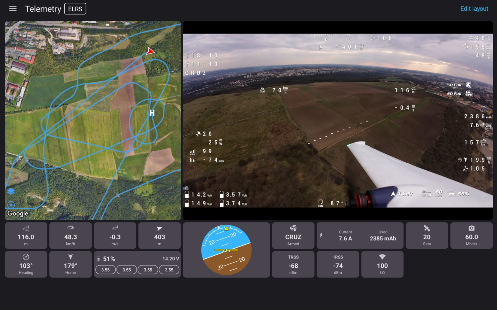
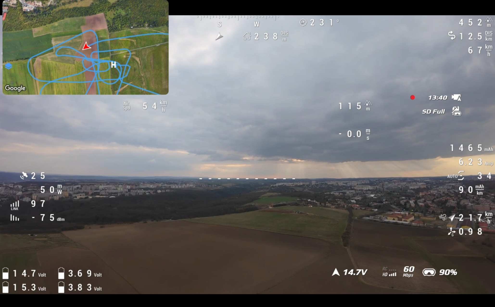

# Telemetry

SquirrelCast supports telemetry from compatible **DJI drones** and from the **ELRS backpack over Wi-Fi**.

  
  

## Viewing telemetry in the app

SquirrelCast has two main places where telemetry can be viewed inside the app:

- the **Telemetry** tab
- the **map overlay** in the **Player**

The app supports both **landscape** and **portrait** mode. The Telemetry tab is usually easiest to use in landscape, especially on larger screens, but it also works in portrait. For telemetry viewing, the best experience is usually on a tablet.

For more detail, see [Viewing telemetry in the app](viewing-telemetry-in-the-app.md).

## Viewing telemetry while streaming

When streaming video over Wi-Fi to a browser, SquirrelCast can also export telemetry to the Web UI, including the map and selected stats.

For more detail, see [Viewing telemetry in the Web UI](viewing-telemetry-in-the-webui.md) and [Streaming Video Over Wi-Fi](streaming-over-wifi.md).

## Supported telemetry sources and protocols

- **DJI drones** can send telemetry directly through the goggles connection.
- **ELRS backpack over Wi-Fi** currently works using **CRSF telemetry over Wi-Fi UDP broadcast**.
- **MAVLink** support in the app is planned, but it is not available yet.

For setup details, see:

- [Receiving telemetry from DJI drones](receiving-telemetry-from-dji-drones.md)
- [Receiving telemetry from the ELRS backpack over Wi-Fi](receiving-telemetry-from-elrs-backpack-over-wifi.md)

## Logging and tools

Telemetry can also be logged to CSV and used with the parsing tool.

- [Telemetry Logging](telemetry-logging.md)
- [Telemetry Parsing Tool](https://xnuclearsquirrel.github.io/SquirrelCast-Public/tools/telemetry-parsing/)
