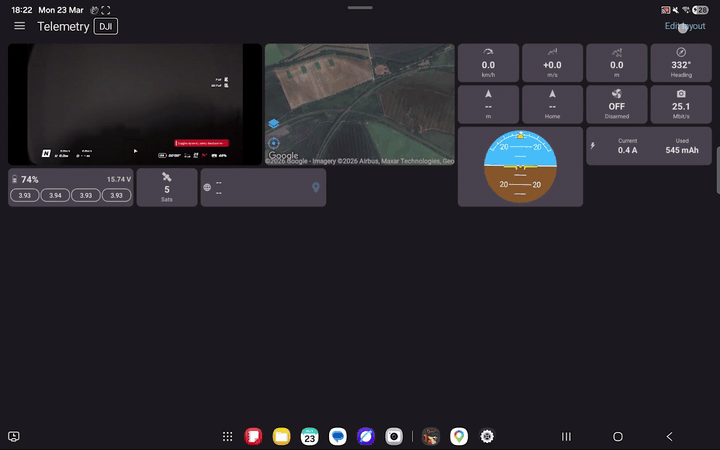
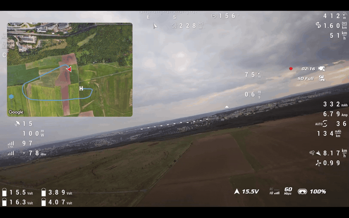
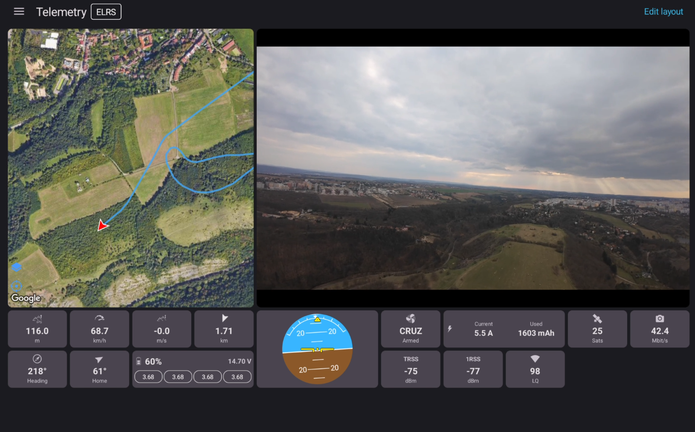
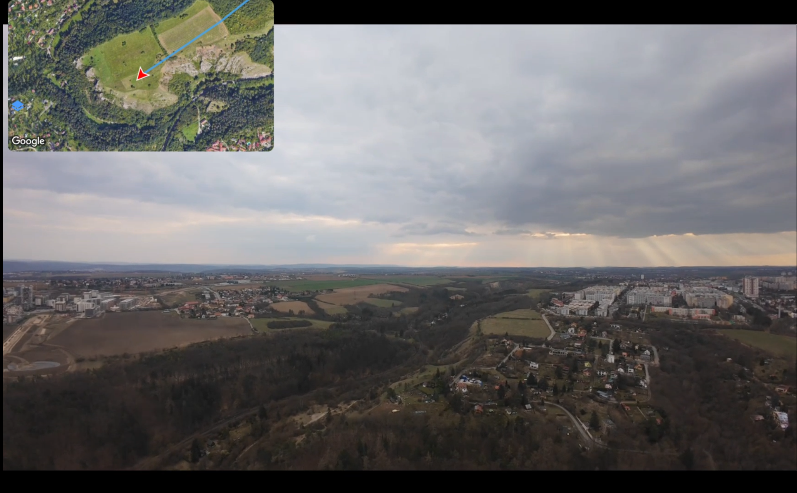

# Viewing Telemetry in the App

SquirrelCast has two main places where telemetry can be viewed inside the app:
- the **Telemetry** tab
- the **map overlay** in the **Player**

The app supports both **landscape** and **portrait** mode. The Telemetry tab is usually easiest to use in landscape, especially on larger screens, but it also works in portrait. For telemetry viewing, the best experience is usually on a tablet.

## Telemetry tab

The Telemetry tab shows telemetry as a grid of widgets. The number of widgets per row is calculated dynamically based on the screen size, and widget size can be adjusted in the app settings.

### Edit the layout

To rearrange the widget layout:

1. Open the **Telemetry** tab.
2. Select **Edit layout**, or simply long-press a widget.
3. Long-press and drag widgets to move them.
4. Use the `+` and `-` buttons in the widget corners to add or remove widgets.

Some widgets, such as **Map**, **Player**, and **Horizon**, can also be resized to span more or fewer slots. To resize them, long-press a corner and drag it.

### Widget details

- The **Coordinates** widget always shows the latest known position, even if the connection is lost.
- Tapping the **map pin** icon on the Coordinates widget opens that position in an external map app.

### Map types and caching

The map inside the app uses the **Google Maps SDK** and offers:
- **Normal**
- **Satellite**
- **Hybrid** (satellite imagery with roads and labels)

Google Maps caches tiles locally. That means you can scout a spot in the Telemetry tab while you still have internet, then go fly there later and keep using the cached map even without a data connection.

The map cache is shared between the **Telemetry** tab and the **Player**, so if the map has already been loaded in one of them, it will also be available in the other.

## Map overlay in the Player

The **Player** can also show telemetry directly over the live video, including the map overlay.

As soon as a valid position is received from telemetry, a **map** icon appears in the bottom left of the Player. Tapping it opens the map overlay.

The map overlay can be adjusted directly on screen:

1. Long-press and drag the map to move it.
2. Long-press and drag the bottom-right corner to resize it.

In the settings, the map can also be changed to a **semi-transparent** or **fully transparent** style. In fully transparent mode, only the track is shown.

The map overlay uses the same Google Maps SDK, the same map types, and the same shared cache as the Telemetry tab. This means you can preload an area in one view and it will already be available in the other.

## Clean video (no OSD)

Because the Telemetry tab and the Player map overlay already show most of the important information, it often makes sense to turn off the OSD in the video feed and use a clean video image instead.

To do that, follow the goggles setting described in [Clean video feed (no MSP OSD)](streaming-over-wifi.md#clean-video-feed-no-msp-osd).

  
  

