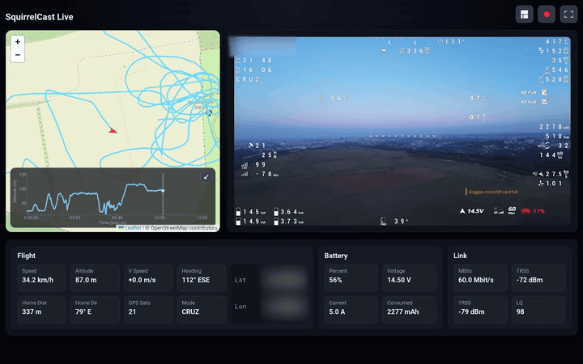
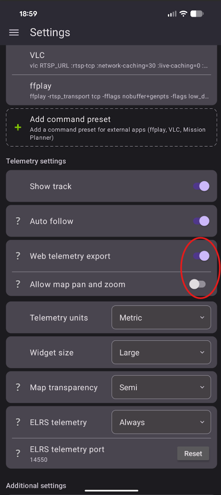

# Viewing Telemetry in the Web UI

Telemetry can also be shown in the browser-based Web UI while streaming video over Wi-Fi.

## Enable Web telemetry export

1. Open **Settings** in SquirrelCast.
2. Enable **Web telemetry export**.
3. Start streaming video to a browser as described in [Streaming Video Over Wi-Fi](streaming-over-wifi.md#stream-to-a-browser-webrtc).

When this setting is enabled, the Web UI can show telemetry overlays such as the **map** and certain **stats** together with the live video.

If the setting is disabled, the browser stream contains **video only**.

> **Warning:** Showing telemetry in the Web UI can increase video lag, especially if the receiving device is sharing an internet connection with the phone. If low latency matters more than telemetry, leave **Web telemetry export** turned off.

## Allow map pan and zoom

There is also a setting called **Allow map pan and zoom**.

By default, the map in the Web UI is fixed and follows the aircraft. If **Allow map pan and zoom** is enabled, the user can move and zoom the map manually in the browser.

This causes even more map loading, so it is even more likely to introduce video lag. It is best to test this in your own setup and only leave it enabled if the performance is still acceptable.
